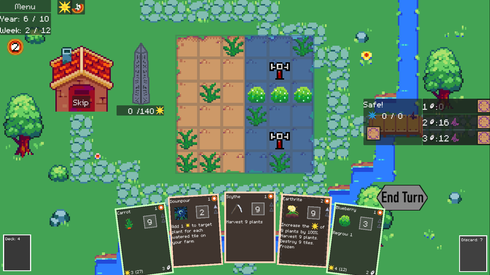
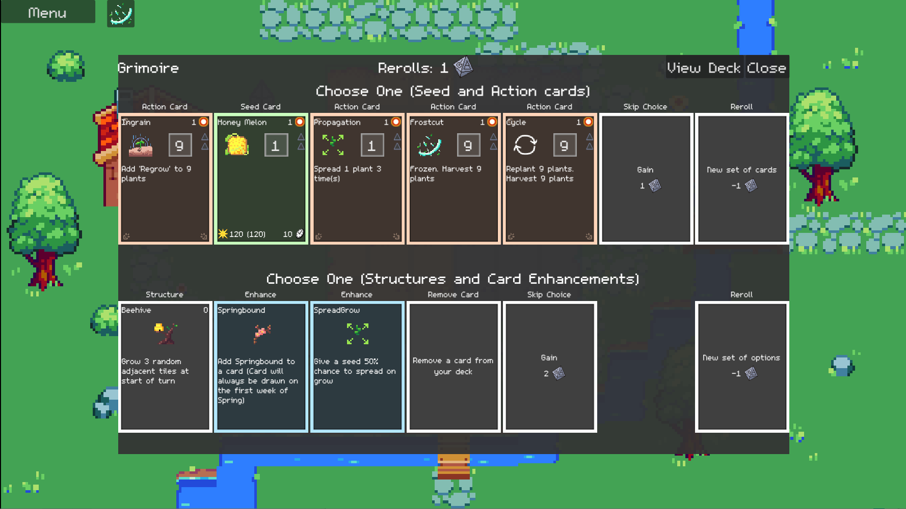
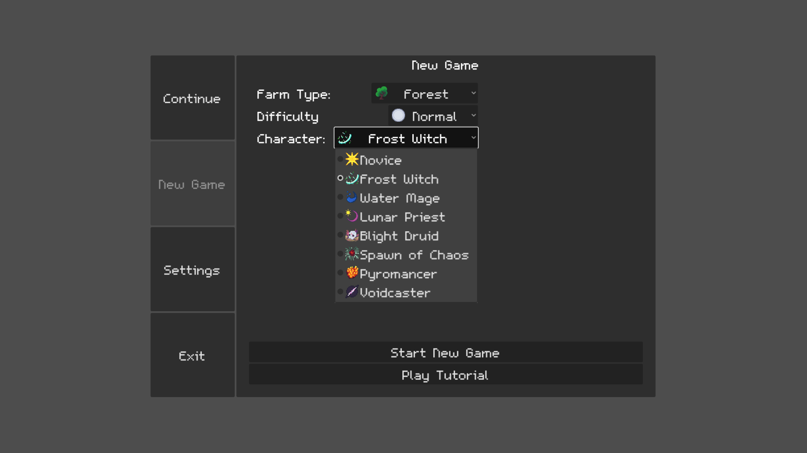

# Earthrite

by Felix Lapierre

Version 0.0.9 released on January 15th ([Changelog](docs/CHANGELOG.md))

[Download](#download)

- [Download for Windows](#Windows)

- [Download for Mac](#Mac)

- [Download for Android](#android)

- [Download for Linux](#linux)

- [Download for iOS](#ios-experimental)

- [Play in a Web Browser](#web-browser)

[How to Play](#how-to-play)

[Screenshots](#screenshots)

[Credits](#credits)

## Download

### Windows

Simply [download Earthrite.exe from this link.](https://drive.google.com/file/d/1leb7dkDjaplnB0dKa3hauKQunD9kOC0a/view?usp=sharing)

Double click on the executable to run it. You may get an antivirus warning because downloading an executable file on the internet is risky, but I assure you the game contains no viruses.

### MacOS

[Download Earthrite.zip](https://drive.google.com/file/d/1aqqyLbR_wiAv9_s52ZxXlQZF8X8-7ngb/view?usp=sharing)

Just open on the link and then click the "Download" icon on the top right. Google Drive will display a file folder, just ignore that.

Once you've downloaded Earthrite.zip, unzip the folder, and move the application file to the Applications folder.

When you run the app for the first time, the following dialog is displayed:

> "Earthrite" can't be opened because Apple cannot check it for malicious software.
> 
> The software needs to be updated. Contact the developer for more information

To run the app, you can temporarily override Gatekeeper: Open System Preferences, click Security & Privacy, then click General. You will see "FarmingDeckbuilder" was blocked from use because it is not from an identified developer. Click "Open Anyway".

- On MacOS Sonoma: click System Settings then Privacy & Security, then scroll down to the Security section, then click Open Anyways 

### Android

[Download Earthrite.apk from this link](https://drive.google.com/file/d/1u8tIv5_YUiwHJMcnDsD9VrZoobeyw-x6/view?usp=sharing)

Your phone may ask you to enable downloading APKs from Google Chrome. You can disable this setting once the installation is complete.

Alternatively, you can play the game as a Progressive Web App directly in your browser at [https://felixlapierre.github.io/earthrite/](https://felixlapierre.github.io/earthrite/). You can open the More menu and select Add to Home Screne to install the app. However, the APK method above is recommended as the game will have better performance, work offline, and be fullscreen.

### Linux

[Download Earthrite.x86_64](https://drive.google.com/file/d/1Kd9oHDe_nLvkda3v8JInBhzVMozS0jbM/view?usp=sharing)

I've never actually tested the game on Linux, so let me know if this works.

### iOS [EXPERIMENTAL]

Open Safari and copy-paste this link into the web browser: [https://felixlapierre.github.io/earthrite/](https://felixlapierre.github.io/earthrite/)

The game may take a while to load. If you see an error, try refreshing the page. You can play the game directly in the web browser, but it's recommended to install the app as a "Progressive Web App". Simply press the "Share" button and select "Add to Home Screen" from the popup. Lastly, tap "Add" in the top right corner to finish installing the app.

iOS support is still unstable: the app will crash or fail to run on some devices.

### Web Browser

To play directly in the browser, go to  [https://felixlapierre.github.io/earthrite/](https://felixlapierre.github.io/earthrite/). The game may take a while to load. If you see an error, try refreshing the page. You will lose your save data if you clear your browsing data, and some visuals may not look as nice, so it is recommended to download and install the game for the platform of your choice instead.

## How to Play

You are a mage tasked with cleansing the Blighted Forest from the evil that corrupts it.

You must complete a ritual every year, for ten years, by gathering magic from growing and harvesting various magical plants.

However, you must protect yourself from the Blight's attacks. Harvest plants on the purple tiles of your farm will instead protect you from the Blight, while harvesting plants on the yellow tiles on your farm will progress the Ritual to end the year.

Between years, use the Shop and Events to acquire more cards and make your deck stronger. Complete the final ritual on year 11 (or 10 on easy difficulty) to win the game!

## Screenshots

## Credits

Some assets are taken from the [Tiny Garden asset pack by kathychow](https://kathychow.itch.io/16x16-tiny-garden-free-pack)
