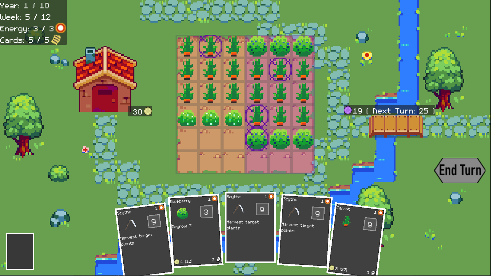
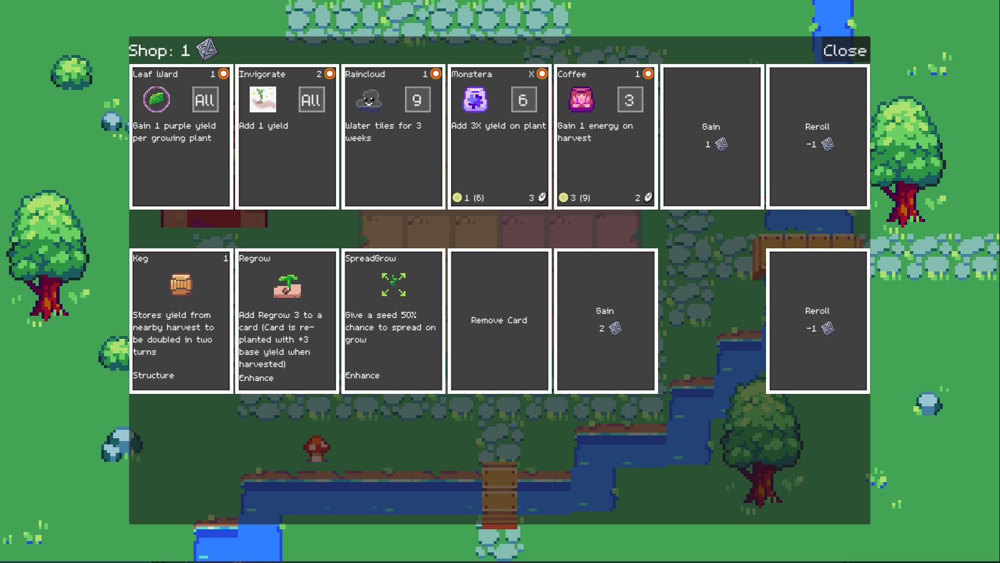

## Farming Deckbuilder

by Felix Lapierre

Version 0.0.3 released on Sept 10th ([Changelog](docs/CHANGELOG.md))

### Download

[Download for Windows](https://drive.google.com/file/d/1PcUSdRndIwx6YSG7kH4FUZ9J5JX0olmw/view?usp=sharing)

[Download for Linux](https://drive.google.com/file/d/1To1PxeOW_y9GlZ4wNOYile1MPXz_Ql4t/view?usp=sharing)

[Download for MacOS](https://drive.google.com/file/d/1axoEeiu4KYO_rstGDVbbsQZqViINLOEh/view?usp=sharing)

Running on MacOS

Download FarmingDeckbuilder.zip from the above link, unzip the folder, and move the application file to the Applications folder.

When you run the app for the first time, the following dialog is displayed:

> "FarmingDeckbuilder" can't be opened because Apple cannot check it for malicious software.
> 
> The software needs to be updated. Contact the developer for more information

To run the app, you can temporarily override Gatekeeper: Open System Preferences, click Security & Privacy, then click General. You will see "FarmingDeckbuilder" was blocked from use because it is not from an identified developer. Click "Open Anyway".

- On MacOS Sonoma: click System Settings then Privacy & Security, then scroll down to the Security section, then click Open Anyways 

### Feedback

If you have any feedback after playing the game I would love to hear it!

[Feedback Form](https://forms.gle/JMJbESQnqYpCbsV97)

### How to Play

You are a mage tasked with cleansing the Blighted Forest from the evil that corrupts it.

You must complete a ritual every year, for ten years, by gathering magic from growing and harvesting various magical plants.

However, you must protect yourself from the Blight's attacks. Harvest plants on the purple tiles of your farm will instead protect you from the Blight, while harvesting plants on the yellow tiles on your farm will progress the Ritual to end the year.

Between years, use the Shop and Events to acquire more cards and make your deck stronger. Complete the final ritual on year 11 (or 10 on easy difficulty) to win the game!

## Screenshots

## Credits

Some assets are taken from the [Tiny Garden asset pack by kathychow](https://kathychow.itch.io/16x16-tiny-garden-free-pack)
